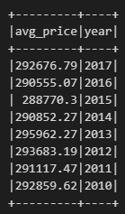

# Home Sales Challenge 


# Table of Contents

- [Home Sales Challenge](#home-sales-challenge)
- [Table of Contents](#table-of-contents)
- [Challenge Overview](#challenge-overview)
- [Prerequisites](#prerequisites)
  - [Required Tools](#required-tools)
  - [Windows Installation Process](#windows-installation-process)
  - [Repository Setup](#repository-setup)
- [Repository Structure](#repository-structure)
- [Challenge Instructions](#challenge-instructions)
- [Code Example](#code-example)
  - [Four-Bedroom Average Home Price(s) Output](#four-bedroom-average-home-prices-output)
- [Analysis](#analysis)
- [Acknowledgements](#acknowledgements)
- [Author](#author)


# Challenge Overview
This challenge utilizes PySpark and SparkSQL to analyze home sales data. The analysis focuses on average home prices for various conditions, such as the number of bedrooms, bathrooms, and house size. Additionally, performance comparisons are made using cached and partitioned datasets.


# Prerequisites

For the Home Sales Challenge, ensure you complete the following requirements:

## Required Tools 
- Install Visual Studio Code and Python on your machine 
- Install the Pandas, Scikit-learn and PySpark libraries
- Create a account on Google Colab

## Windows Installation Process
- Open your terminal or command prompt and run the following commands:

  ``` 
     pip install pandas
     pip install pyspark
   ```

## Repository Setup
  - Create a new repository called ```home_sales-challenge``` on GitHub with a README file
  - Clone the repository to your local machine:   
  ```git clone https://github.com/yourusername/home-sales.git``` 
  - Navigate into the repository folder and add the starter file Home_Sales_starter_colab.ipynb to the folder
  - Push the changes to your GitHub repository

```
git add .
git commit -m "Pushing updated notebook"
git push origin main
```


# Repository Structure
```
├── Home_Sales/
│   ├── Images
│   ├── Home_Sales_colab
│   ├── README.md
│   └── .gitignore
               
```

# Challenge Instructions 

Complete the following tasks:  
- Calculating average home prices based on different factors.
- Comparing query performance with and without caching.
- Partitioning the dataset by the year the house was built.


# Code Example

```VS Code
# Create a temporary view of the DataFrame.

df.createOrReplaceTempView("home_sales")

# What is the average price for a four bedroom house sold per year, rounded to two decimal places?

avg_df = spark.sql("""
    SELECT ROUND(AVG(price), 2) AS avg_price, YEAR(date) AS year
    FROM home_sales
    WHERE bedrooms == 4
    GROUP BY YEAR(date)
    ORDER BY YEAR(date) DESC
""")
avg_df.show()
```

## Four-Bedroom Average Home Price(s) Output


# Analysis
1. The average price for a four-bedroom house between 2019 and 2022 ranged from $296,000 to $301,000, with slight fluctuations, reaching a peak of $301,819.44 in 2021.
2. The average price of a home with three bedrooms and three bathrooms, built between 2010 and 2017, stayed fairly consistent, ranging from $288,770.30 to $295,962.27. Prices had minor fluctuations, peaking in 2013 at $295,962.27.
3. The average price of homes with at least 2,000 square feet remained stable over the years with minor changes, hihglighting a demand for larger homes. 
4.  Homes with a 'view' rating higher than 90 or higher ranged between $970,000 and $1,137,400. This indicates that as the 'view' rating improved, so did the average price of the house, signifying that buyers are more likely to pay high prices for homes that have better views. 


# Acknowledgements

I want to mention the following individuals and resources for their assistance and support throughout this assignment: 
- Xpert Learning Assistant and ChatGPT
- Class Activities 


# Author

For any questions or feedback, please contact:
- Name: Gursimran Kaur (Simran)
- Email: kaursimran081999@gmail.com